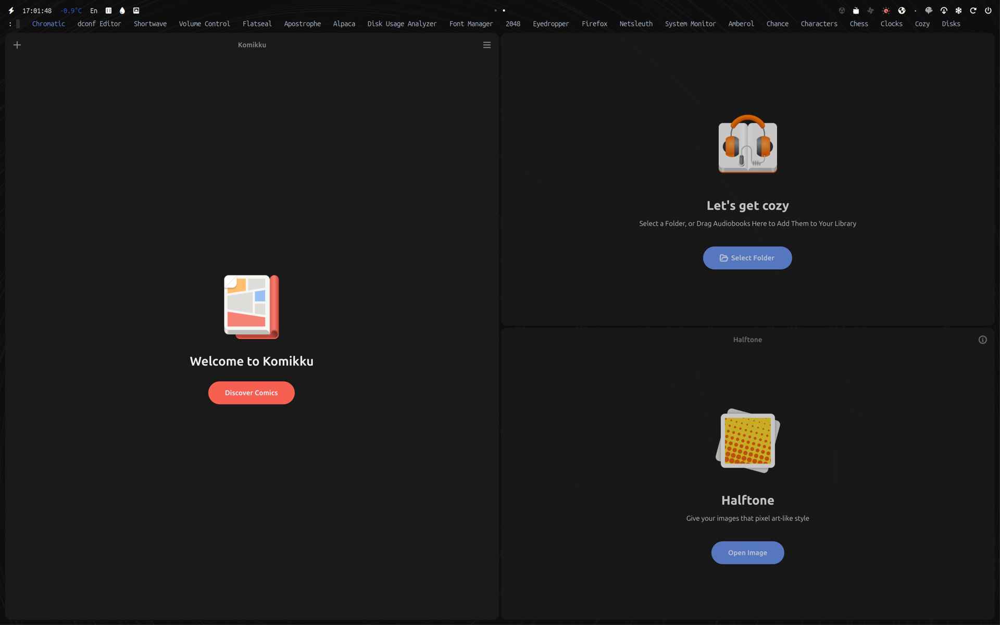

This repository contains personal configurations for Hyprland and other applications. It powered by the Herodot helper script. The settings feature numerous depEndencies (which will be published later) and have been tested exclusively on an ASUS Zenbook Duo 14 OLED laptop with a dual-display setup. Many parameters are specific to this model, yet they can be easily adapted for other systems.

## Features

1. Switch between "van" and "yerevan" color schemes with support for various applications, including:
    - Midnight Commander
    - Neovim with syntax highlighting support, including Tree Sitter
    - GTK (2, 3, and 4)
    - Kitty, Dunst, and more

2. A customizable Waybar with integrated modules and notification system, featuring:
    - Battery status
    - Date and time display
    - Weather information
    - Keyboard layout indicator
    - Dice rolling feature
    - Shutdown options with notifications (lock, restart session, suspEnd, reboot, and power off)
    - System information (RAM usage, CPU load and temperature, GPU temperature)
    - Toggle between discrete and integrated graphics
    - Enable/disable system idle tracking and automatic shutdown
    - Fan control (on/off)
    - Performance mode switching (power-saving and high-performance modes)
    - Volume and microphone control
    - Bluetooth status and controls
    - Wi-Fi status and controls# Demo

3. A power management daemon that monitors network power and smartly switches between performance modes as necessary.

4. A dedicated low battery notification daemon that provides timely alerts for low battery levels.

5. A system notification daemon that monitors system notifications and displays them within Waybar for easy access.

6. A comprehensive set of keyboard shortcuts for seamless interaction with your environment and peripherals.

7. Enhanced usability through support for multi-touch gestures and additional features.

Feel free to explore, customize, and adapt these configurations to meet your unique needs.

# Demo

|  |  |   |   |
|:--:|:--:|:--:|:--:|
| Common | Launcher | Notification | Yerevan Scheme |

# Repository DepEndencies

Below is a list of the primary depEndencies:

1. **acpi**: A tool for displaying information about power management and battery status.
2. **bluez**: The official Bluetooth protocol stack for Linux.
3. **bluez-utils**: Utilities for managing Bluetooth devices and connections.
4. **brightnessctl**: A command-line tool for controlling screen brightness.
5. **dunst**: A lightweight and configurable notification daemon.
6. **font-awesome-6**: A popular icon font library for web applications.
7. **grim**: A screen capture utility for Wayland.
8. **hyprland**: A dynamic tiling Wayland compositor.
9. **hypridle**: A utility for executing commands when the user is idle.
10. **hyprlock**: A screen locker for Wayland compositors.
11. **hyprpaper**: A wallpaper management tool for Hyprland.
12. **intel-nvidia-switch**: Tools for switching between Intel and NVIDIA graphics on hybrid systems.
13. **iwd**: A Wi-Fi daemon for managing wireless connections.
14. **kitty**: A fast, feature-rich terminal emulator.
15. **mc**: Midnight Commander, a text-based file manager.
16. **neovim**: An extensible Vim-based text editor.
17. **nvidia-utils**: Utilities and drivers for NVIDIA graphics cards.
18. **slurp**: A tool for selecting a region of the screen for capturing.
19. **tofi**: A simple menu and notification tool for Wayland.
20. **waybar**: A customizable status bar for Wayland compositors.
21. **weather-Cli**: A command-line interface for fetching weather information.
22. **wl-clipboard**: A simple clipboard manager for Wayland.
23. **wptcl**: A utility for controlling Wayland compositors.
24. **zenity**: A tool for displaying GTK dialog boxes from the command line.

# Hotkeys

| Hotkey                             | Description                                                  |
|------------------------------------|--------------------------------------------------------------|
| Super Alt, K                       | Toggles the current interface mode (dark or light)           |
| Super Alt, M                       | Cycle through available color scheme modes                   |
| Super Alt, N                       | Enable or disable Wi-Fi connection                           |
| Super Alt, B                       | Enable or disable Bluetooth connection                       |
| Super Alt, V                       | Enable or disable Hypridle                                   |
| Super, F1                          | Open the terminal application (Kitty)                        | 
| Super Alt, F1                      | Open the terminal with root privileges (Kitty)               |
| Super, F2                          | Launch the file manager (Nautilus)                           |
| Super, F3                          | Open the Firefox web browser                                 |
| Super Alt, F3                      | Launch Firefox in private browsing mode                      |
| Super, F4                          | Open the Thunderbird client                                  |
| Super Alt, F4                      | Create a new email compose window in Thunderbird             |
| Super, F5                          | Start the Obsidian                                           |
| Super, F6                          | Open the Planify                                             |
| Super, F7                          | Launch the Dialect translator                                |
| Super, F8                          | Open the calculator                                          |
| Super, F9                          | Start the Shortwave radio streaming app                      |
| XF86MonBrightnessUp                | Increase screen brightness by 5%                             |
| XF86MonBrightnessDown              | Decrease screen brightness by 5%                             |
| Alt, XF86MonBrightnessUp           | Increase screen brightness by 1%                             |
| Alt, XF86MonBrightnessDown         | Decrease screen brightnessy by 1%                            |
| Shift, XF86MonBrightnessUp         | Increase screen brightness to 100%                           |
| Shift, XF86MonBrightnessDown       | Increase screen brightness to 0%                             |
| Super Alt, B                       | Toggles the current blur mode                                |
| Super, Escape                      | Show or hide the Waybar panel                                |
| Super, Grave                       | Show or hide the application launcher                        |
| XF86AudioMicMute                   | Toggle the microphone on/off                                 |
| Super< XF86AudioRaiseVolume        | Increase microphone volume by 5%                             |
| Super, XF86AudioLowerVolume        | Decrease microphone volume by 5%                             |
| Super Alt, XF86AudioRaiseVolume    | Increase microphone volume by 1%                             |
| Super Alt, XF86AudioLowerVolume    | Decrease microphone volume by 1%                             |
| Super Shift, XF86AudioRaiseVolume  | Increase microphone volume to 100%                           |
| Super Shift, XF86AudioLowerVolume  | Decrease microphone volume to 0%                             |
| Super XF86AudioMute                | Toggle microphone mute on/off                                |
| Super, Mouse Left                  | Initiate window movement with drag                           |
| Super, Mouse Right                 | Initiate window resizing with drag                           |
| Super, Mouse Wheel Down            | Switch to the next workspace                                 |
| Super, Mouse Wheel Up              | Switch to the previous workspace                             |
| Super Alt, H                       | Switch the waybar scheme                                     |
| Super, Left                        | Move focus to the window on the Left                         |
| Super, Right                       | Move focus to the window on the Right                        |
| Super, Up                          | Move focus to the window above                               |
| Super, Down                        | Move focus to the window below                               |
| Ctrl Alt, Enter                    | Toggles the current window into a group                      |
| Shift Ctrl Alt, Enter              | Lock and unlock the current group                            |
| Ctrl Alt, Left                     | Activate the previous window in the current group            |
| Ctrl Alt, Right                    | Activate the next window in the current group                |
| Ctrl Alt, Home                     | Move the window to the Left group                            |
| Ctrl Alt, End                      | Move the window to the Right group                           |
| Ctrl Alt, Page Up                  | Move the window to the group above                           |
| Ctrl Alt, Page Down                | Move the window to the group below                           |
| Super Alt, Home                    | Move the active window to the previous workspace             |
| Super Alt, End                     | Move the active window to the next workspace                 |
| Super Alt, Page Up                 | Move the active window to the previous monitor               |
| Super Alt, Page Down               | Move the active window to the next monitor                   |
| Super Ctrl Alt, Home               | Move the active window to the first workspace                |
| Super Ctrl Alt, End                | Move the active window to the last workspace                 |
| Super Shift Alt, Home              | Move the active window to the previous workspace (silent)    |
| Super Shift Alt, End               | Move the active window to the next workspace (silent)        |
| Super Alt, Left                    | Shift the active window to the Left                          |
| Super Alt, Right                   | Shift the active window to the Right                         |
| Super Alt, Up                      | Shift the active window upwards                              |
| Super Alt, Down                    | Shift the active window downwards                            |
| Super Shift Alt, W                 | Disable wallpaper                                            |
| Super Alt, W                       | Enable wallpaper or select the next                          |
| Super, Q                           | Close the currently active window                            |
| Super Shift, Q                     | Close all instances of the active window                     |
| Super Alt, R                       | Enter window resize mode                                     |
| Super, Grave                       | Show the special workspace                                   |
| Super, Grave (Long Press)          | Move the active window to the special workspace              |
| Print                              | Capture a screenshot of the entire screen to clipboard       |
| Ctrl, Print                        | Capture a screenshot of the current workspace to clipboard   |
| Shift, Print                       | Capture a screenshot of selected area to clipboard           |
| Alt, Print                         | Capture a screenshot of the active window to clipboard       |
| Super, Print                       | Capture an entire screenshot and save it as a file           |
| Super Ctrl, Print                  | Capture the current workspace and save it as a file          |
| Super Shift, Print                 | Capture selected area and save it as a file                  |
| Super Alt, Print                   | Capture the active window and save it as a file              |
| Super, XF86MonBrightnessDown       | Disable the shader effect                                    |
| Super, XF86MonBrightnessUp         | Enable the shader effect                                     |
| Super Alt, Escape                  | Lock the screen                                              |
| Super Alt, Backspace               | Exit the Hyprland session                                    |
| Super Alt, Delete                  | Reboot the system                                            |
| Super, XF86PowerOff                | Reboot the system                                            |
| XF86PowerOff                       | Power off the computer                                       |
| XF86AudioRaiseVolume               | Increase speaker volume by 5%                                |
| XF86AudioLowerVolume               | Decrease speaker volume by 5%                                |
| Alt, XF86AudioRaiseVolume          | Increase speaker volume by 1%                                |
| Alt, XF86AudioLowerVolume          | Decrease speaker volume by 1%                                |
| Shift, XF86AudioRaiseVolume        | Increase speaker volume to 100%                              |
| Shift, XF86AudioLowerVolume        | Decrease speaker volume to 0%                                |
| XF86AudioMute                      | Toggle speaker mute on/off                                   |
| Super Tab, Left                    | Swap the active window with the window on the Left           |
| Super Tab, Right                   | Swap the active window with the window on the Right          |
| Super Tab, Up                      | Swap the active window with the window above                 |
| Super Tab, Down                    | Swap the active window with the window below                 |
| Super, F                           | Toggle the floating state of the window                      |
| Super, P                           | Pin the active window to stay on top                         |
| Super, T                           | Toggle between split and single window view                  |
| Super Shift, T                     | Swap the current split layout                                |
| Super, C                           | Center the active window on the screen                       |
| Super Ctrl, Right                  | Move to the next workspace                                   | 
| Super Ctrl, Left                   | Move to the previous workspace                               |
| Super Ctrl, Home                   | Move to the first workspace                                  |
| Super Ctrl, End                    | Move to the last workspace                                   |
| Super Alt, 2                       | Zoom the interface to 200%                                   |
| Super Alt, 1                       | Reset the interface zoom level                               |

# Structure

```
.
├── .config
│   ├── ashot
│   │   └── config
│   ├── dunst
│   │   ├── dunstrc -> schemes/van
│   │   └── schemes
│   │       ├── erzurum
│   │       ├── van
│   │       └── yerevan
│   ├── gtk-3.0
│   │   ├── bookmarks
│   │   ├── gtk.css -> schemes/van.css
│   │   ├── schemes
│   │   │   ├── erzurum.css
│   │   │   ├── van.css
│   │   │   └── yerevan.css
│   │   └── settings.ini
│   ├── gtk-4.0 -> gtk-3.0
│   ├── herodot
│   │   ├── session.conf
│   │   └── session.conf.bak
│   ├── hypr
│   │   ├── hypridle.conf
│   │   ├── hyprland
│   │   │   ├── bind
│   │   │   │   ├── actions.conf
│   │   │   │   ├── applications.conf
│   │   │   │   ├── blur.conf
│   │   │   │   ├── brightness.conf
│   │   │   │   ├── clipboard.conf
│   │   │   │   ├── environment.conf
│   │   │   │   ├── microphone.conf
│   │   │   │   ├── mouse.conf
│   │   │   │   ├── movefocus.conf
│   │   │   │   ├── movegroup.conf
│   │   │   │   ├── movetoworkspace.conf
│   │   │   │   ├── movewindow.conf
│   │   │   │   ├── paper.conf
│   │   │   │   ├── process.conf
│   │   │   │   ├── resize.conf
│   │   │   │   ├── scratchpad.conf
│   │   │   │   ├── screenpad.conf
│   │   │   │   ├── screenshot.conf
│   │   │   │   ├── shader.conf
│   │   │   │   ├── shutdown.conf
│   │   │   │   ├── speaker.conf
│   │   │   │   ├── swapwindow.conf
│   │   │   │   ├── touchpad.conf
│   │   │   │   ├── waybar.conf
│   │   │   │   ├── window.conf
│   │   │   │   ├── workspace.conf
│   │   │   │   └── zoom.conf
│   │   │   ├── bind.conf
│   │   │   ├── common
│   │   │   │   ├── cursor.conf
│   │   │   │   ├── environment.conf
│   │   │   │   ├── exec-once.conf
│   │   │   │   ├── monitors.conf
│   │   │   │   ├── windowrules.conf
│   │   │   │   └── xwayland.conf
│   │   │   ├── common.conf
│   │   │   ├── input
│   │   │   │   ├── gestures.conf
│   │   │   │   ├── input.conf
│   │   │   │   ├── mouse.conf
│   │   │   │   ├── stylus.conf
│   │   │   │   ├── touchpad.conf
│   │   │   │   └── touchscreen.conf
│   │   │   ├── input.conf
│   │   │   ├── layout
│   │   │   │   ├── animation.conf
│   │   │   │   ├── blur.conf -> blurs/none.conf
│   │   │   │   ├── blurs
│   │   │   │   │   ├── glass.conf
│   │   │   │   │   └── none.conf
│   │   │   │   ├── decoration.conf
│   │   │   │   ├── dwindle.conf
│   │   │   │   ├── general.conf
│   │   │   │   ├── group.conf
│   │   │   │   ├── master.conf
│   │   │   │   └── misc.conf
│   │   │   ├── layout.conf
│   │   │   ├── scheme.conf -> schemes/van.conf
│   │   │   └── schemes
│   │   │       ├── erzurum.conf
│   │   │       ├── van.conf
│   │   │       └── yerevan.conf
│   │   ├── hyprland.conf
│   │   ├── hyprlock.conf -> locks/van.conf
│   │   ├── hyprpaper.conf
│   │   ├── locks
│   │   │   ├── erzurum.conf
│   │   │   ├── van.conf
│   │   │   └── yerevan.conf
│   │   ├── papers
│   │   │   ├── current -> ~/.config/hypr/papers/sky
│   │   │   ├── sky
│   │   │   │   ├── screenpad.png
│   │   │   │   ├── screen.png
│   │   │   │   └── sky -> ~/.config/hypr/papers/sky
│   │   │   ├── sunrise
│   │   │   │   ├── screenpad.png
│   │   │   │   ├── screen.png
│   │   │   │   └── sunrise -> ~/.config/hypr/papers/sunrise
│   │   │   └── sunset
│   │   │       ├── screenpad.png
│   │   │       ├── screen.png
│   │   │       └── sunset -> ~/.config/hypr/papers/sunset
│   │   └── shaders
│   │       ├── abyss
│   │       ├── caramel-bach
│   │       ├── caramel-beethoven
│   │       ├── caramel-mozart
│   │       ├── caramel-schubert
│   │       ├── matrix
│   │       ├── negative
│   │       ├── vhs
│   │       └── vibrance
│   ├── kitty
│   │   ├── kitty.conf
│   │   ├── scheme.conf -> schemes/van.conf
│   │   └── schemes
│   │       ├── erzurum.conf
│   │       ├── van.conf
│   │       └── yerevan.conf
│   ├── mc
│   │   ├── ini
│   │   ├── mc -> ~/.config/mc
│   │   └── panels.ini
│   ├── nvim
│   │   ├── colors
│   │   │   ├── erzurum.lua
│   │   │   ├── van.lua
│   │   │   └── yerevan.lua
│   │   ├── init.lua
│   │   ├── lazy-lock.json
│   │   └── lua
│   │       ├── config
│   │       │   ├── lazy.lua
│   │       │   └── set.lua
│   │       ├── plugins.lua
│   │       └── schemes
│   │           ├── erzurum
│   │           │   ├── core.lua
│   │           │   ├── init.lua
│   │           │   ├── palette.lua
│   │           │   └── ts.lua
│   │           ├── van
│   │           │   ├── core.lua
│   │           │   ├── init.lua
│   │           │   ├── palette.lua
│   │           │   └── ts.lua
│   │           └── yerevan
│   │               ├── core.lua
│   │               ├── init.lua
│   │               ├── palette.lua
│   │               └── ts.lua
│   ├── qt5ct
│   │   ├── colors
│   │   ├── qss
│   │   └── qt5ct.conf
│   ├── qt6ct
│   │   ├── colors
│   │   ├── qss
│   │   └── qt6ct.conf
│   ├── tofi
│   │   ├── config -> schemes/van
│   │   └── schemes
│   │       ├── erzurum
│   │       ├── van
│   │       └── yerevan
│   └── waybar
│       ├── config
│       ├── schemes
│       │   ├── erzurum.css
│       │   ├── van.css
│       │   └── yerevan.css
│       └── style.css -> schemes/van.css
├── .gtkrc-2.0 -> ~/.config/gtk-3.0/settings.ini
├── .local
│   ├── bin
│   │   ├── ashot
│   │   ├── herodot
│   │   ├── herodot-audio
│   │   ├── herodot-battery
│   │   ├── herodot-bluetooth
│   │   ├── herodot-blur
│   │   ├── herodot-brightness
│   │   ├── herodot-darkmode
│   │   ├── herodot-dice
│   │   ├── herodot-fan
│   │   ├── herodot-gpu
│   │   ├── herodot-idle
│   │   ├── herodot-keyboard
│   │   ├── herodot-movetoworkspace
│   │   ├── herodot-movewindow
│   │   ├── herodot-paper
│   │   ├── herodot-performance
│   │   ├── herodot-scheme
│   │   ├── herodot-screenpad
│   │   ├── herodot-settings
│   │   ├── herodot-shader
│   │   ├── herodot-shutdown
│   │   ├── herodot-submap
│   │   ├── herodot-touchpad
│   │   ├── herodot-waybar
│   │   ├── herodot-weather
│   │   ├── herodot-wifi
│   │   ├── herodot-workspace
│   │   ├── herodot-zoom
│   │   ├── mod-desktop
│   │   ├── poweralert-daemon
│   │   ├── powermoder-daemon
│   │   ├── waynot
│   │   └── waynot-daemon
│   └── share
│       └── mc
│           └── skins
│               ├── erzurum.ini
│               ├── van.ini
│               └── yerevan.ini
└── .zshrc

54 directories, 169 files
```
